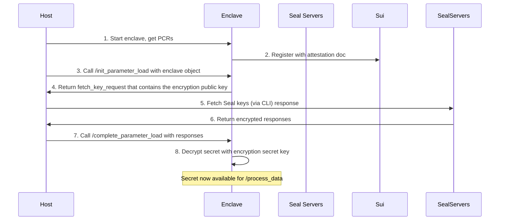

# Seal-Nautilus Pattern

The Seal-Nautilus pattern provides secure secret management for enclave applications, ensuring the Seal secret is only accessible within verified enclaves. Here we reuse the weather example. Instead of storing the `weather-api-key` with AWS Secret Manager, we store it with Seal, and shows that only the enclave with the expected PCRs have access to it. 

## Components

1. Nautilus Enclave (Port 3000) running inside AWS Nitro enclave: This is the only place that has access to the decrypted Seal secret. It also handles using the secret to process data. 

2. Host-Only Server (Port 3001) running on the host where the enclave is, it can only be used to initialize and complete the bootstrap steps to set the secret.

3. Seal CLI that can be ran anywhere. It has an encrypt and a fetch key function.

4. On-Chain Components: `seal_policy.move` defines the `seal_approve` policy. 

## Data Flow



## Two-Phase Bootstrap

The enclave is first registered and started running. The secret is then loaded via host only commands. 

```
Phase 1: Registration (No Secrets Needed)
├── 1. Start enclave with empty/placeholder secrets
├── 2. Generate attestation document  
├── 3. Register enclave on-chain → Get Enclave Object
└── 4. Enclave is now registered but not yet populated with the secret to serve request

Phase 2: Secret Loading (Using Registered Enclave)
├── 1. Host calls /init_parameter_load with the Enclave Object
├── 2. Enclave creates a signed Seal request using its ID
├── 3. Host fetches encrypted keys from Seal servers
├── 4. Host calls /complete_parameter_load to deliver encrypted secrets
└── 5. Enclave decrypts and loads secrets → Now fully functional
```

### Why Two-Phase Bootstrap?

The two-phase bootstrap is needed because enclaves operate without direct internet access and cannot fetch secrets from Seal key servers URL themselves. As a workaround, the host acts as an intermediary to retrieve encrypted secrets from Seal servers. This delegation is secure because the fetched responses are encrypted using the enclave's ephemeral public key, and only the enclave possesses the corresponding private key for decryption. Additionally, the enclave is booted with hardcoded public keys of the Seal servers it depends on, so it can verify the authenticity of the responses passed from host, so the host cannot tamper with or forge server responses.

## Security Guarantees

The secret is only accessible within the verified enclave because:

- **Ephemeral Key Generation**: The enclave generates an unique ElGamal key pair during initialization.
- **Encrypted Transport**: Seal servers encrypt the secret to this ephemeral public key. The host receives it but cannot decrypt it, only the enclave can. 
- **Private Key Isolation**: The ephemeral private key never leaves the enclave memory.
- **Attestation Binding**: The on-chain `seal_approve` function verifies signature against the enclave public key. The signature can only be produced by the enclave held wallet. 

## Seal Approval Function

```move
entry fun seal_approve<T: drop>(
    _id: vector<u8>, 
    enclave: &Enclave<T>, 
    signature: vector<u8>, 
    ctx: &TxContext
) {
    // Verify the enclave's ephemeral key signs over the enclave's wallet address
    let payload = bcs::to_bytes(&ctx.sender());
    assert!(ed25519::ed25519_verify(&signature, enclave.pk(), &payload), ENoAccess);
}
```

This function ensures the signature is verified against the enclave public key. The transaction sender matches the enclave's wallet address. The `id` can be anything that identifies the key identity, e.g. `weather-api-key` in bytes.

## Using the seal-example weather service:

### Step 0: Build and Register Enclave

```bash
make ENCLAVE_APP=seal-example

# todo: replace with real pcrs
PCR0=000000000000000000000000000000000000000000000000000000000000000000000000000000000000000000000000
PCR1=000000000000000000000000000000000000000000000000000000000000000000000000000000000000000000000000
PCR2=000000000000000000000000000000000000000000000000000000000000000000000000000000000000000000000000

ENCLAVE_PACKAGE_ID=0xc1f1741024ea94dd2eb8b870ae01944fbec60f785cf95e5437908ed401f99c97

CAP_OBJECT_ID=0x26e2329e4a174306299b83f56b2e0dcf5583f3977bb39bcb142d17c8c4ea40a8
ENCLAVE_CONFIG_OBJECT_ID=0x41e0fada7274416ed0a559a3e6c8a790ce4c323307dabe2dcb70e8d8212f6cc5
APP_PACKAGE_ID=0xfaeabd7f317dd7ae40d83b73cfa68b92795f48540d03f1232b33207e22d0a62f

MODULE_NAME=weather
OTW_NAME=WEATHER
ENCLAVE_URL=http://<PUBLIC_IP>:3000

sh register_enclave.sh $ENCLAVE_PACKAGE_ID $APP_PACKAGE_ID $ENCLAVE_CONFIG_OBJECT_ID $ENCLAVE_URL $MODULE_NAME $OTW_NAME

# read from output the created enclave obj id and finds its initial shared version. 
ENCLAVE_OBJECT_ID=0x7019c4c455f4894018421d54bd300689162fb104ac7d00ef7f6ac4062cfd3e3b
ENCLAVE_OBJ_VERSION=546376961
```

This step can be done anywhere with a Sui wallet. 

Currently, the enclave is running but has no Seal secret and cannot process requests. 
```bash
curl -H 'Content-Type: application/json' -d '{"payload": { "location": "San Francisco"}}' -X POST http://<PUBLIC_IP>:3000/process_data

{"error":"API key not initialized. Please complete parameter load first."}%
```

### Step 1: Encrypt Secret (One-time Setup)

```bash
cargo run --bin seal-cli encrypt --secret 045a27812dbe456392913223221306 \
    --id 0000 \
    -p 0xfaeabd7f317dd7ae40d83b73cfa68b92795f48540d03f1232b33207e22d0a62f \
    -t 2 \
    -k 0x73d05d62c18d9374e3ea529e8e0ed6161da1a141a94d3f76ae3fe4e99356db75,0xf5d14a81a982144ae441cd7d64b09027f116a468bd36e7eca494f750591623c8 \
    -n testnet

Encrypted object: 
<ENCRYPTED_OBJECT>
```

TThe Seal CLI command can be ran in the [Seal repo](https://github.com/MystenLabs/seal). This command looks up the public keys of the specified key servers ID using public fullnode on the given network. Then it uses the identity `id` and threshold `t` to encrypt the secret. This step can be done anywhere where the secret value is secure. The package ID is the package containing the Seal policy. 

### Step 2: Load the encrypted secret to enclave

```bash
curl -X POST http://localhost:3001/seal/init_parameter_load -H 'Content-Type: application/json' -d '{"enclave_object_id": "<YOUR_ENCLAVE_ID>", "initial_shared_version": <ENCLAVE_OBJ_VERSION>, "key_name": "weather_api_key" }'

# Output: {"encoded_request": "<ENCODED_REQUEST>"}
```

This step is done in the host that can communicate to the enclave via 3001. 

**What happens**:
- The enclave generates ephemeral ElGamal keypair and temporily store in memory.
- Then it creates the certificate containing the constructed PTB calling `seal_approve` with enclave object ID.
- The enclave wallet signs request with session key and returns encoded fetch request. 

### Step 3: Fetch Keys from Seal Servers

```bash
cargo run --bin seal-cli fetch-keys --request <ENCODED_REQUEST> \
    -k 0x73d05d62c18d9374e3ea529e8e0ed6161da1a141a94d3f76ae3fe4e99356db75,0xf5d14a81a982144ae441cd7d64b09027f116a468bd36e7eca494f750591623c8 \
    -t 2 \
    -n testnet

Encoded seal responses:
<ENCODED_SEAL_RESPONSES>
```

TThe Seal CLI command can be ran in the [Seal repo](https://github.com/MystenLabs/seal). This command parses the hex BCS encoded `FetchKeyRequest` and fetches keys from the specified key server objects for the given network. This can be done any with Internet connection. 

**What happens**:
- CLI contacts multiple Seal servers using the fetch key request. 
- Each server verifies the PTB and signature, then returns encrypted key shares (encrypted to enclave's ephemeral ElGamal key) if the seal policy is satifies. 
- CLI collects all Seal server responses till threshold is reached. 

### Step 4: Complete Secret Loading

```bash
curl -X POST http://localhost:3001/seal/complete_parameter_load \
  -H "Content-Type: application/json" \
  -d '{
    "encrypted_object": "<ENCRYPTED_OBJECT>",
    "seal_responses": "<SEAL_RESPONSES>"
  }'
null # ok
```

This step is done in the host that can communicate to the enclave via 3001. 

**What happens**:
- The enclave uses its ephemeral secret key to decrypt key shares and performs threshold decryption to recover the secret.
- The enclave stores the decrypted secret in memory.
- The enclave finishes bootstrap and can serve request. 

### Step 5: Use the Service

```bash
curl -H 'Content-Type: application/json' -d '{"payload": { "location": "San Francisco"}}' -X POST http://<PUBLIC_IP>:3000/process_data

{"response":{"intent":0,"timestamp_ms":1755805500000,"data":{"location":"San Francisco","temperature":18}},"signature":"4587c11eafe8e78c766c745c9f89b3bb7fd1a914d6381921e8d7d9822ddc9556966932df1c037e23bedc21f369f6edc66c1b8af019778eb6b1ec1ee7f324e801"}
```

## Handle Multiple Secrets

Repeat step 1 with different `id` values for different secrets.

## Multiple Enclaves