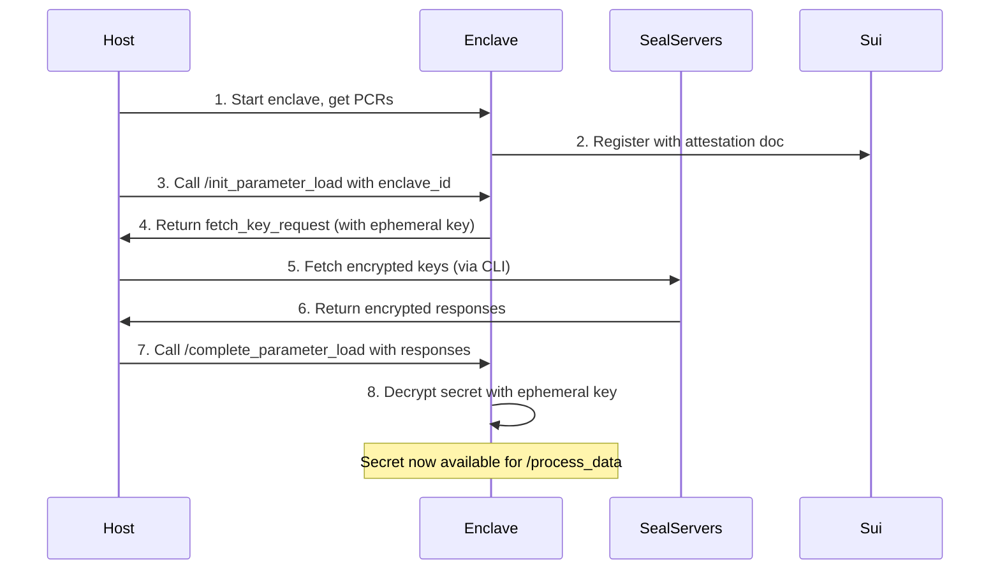

# Seal-Nautilus Pattern

The Seal-Nautilus pattern provides secure secret management for TEE applications, ensuring secrets are only accessible within verified enclaves.

## Components

### 1. Nautilus Enclave (Port 3000)
Runs within AWS Nitro Enclave TEE providing:
- Attestation document generation with PCR measurements
- Secret decryption and secure storage in enclave memory
- Data processing using decrypted secrets
- Ed25519 wallet for on-chain identity

### 2. Host-Only Server (Port 3001)
Bridge between external world and isolated enclave:
- Initiates Seal key retrieval flow
- Routes encrypted responses from Seal servers to enclave
- Manages communication between host and enclave

### 3. Seal CLI
Command-line tool for secret management:
- Encrypts secrets using Seal's threshold encryption
- Fetches encrypted key shares from distributed Seal servers
- Handles threshold recovery logic

### 4. On-Chain Components
Sui Move smart contracts providing:
- Enclave registration and attestation verification
- Access control through `seal_approve` function
- Policy enforcement for secret access

## Data Flow



## Two-Phase Bootstrap

The enclave is first registered and started running. The secret is then loaded via host only commands. 

```
Phase 1: Registration (No Secrets Needed)
├── 1. Start enclave with empty/placeholder secrets
├── 2. Generate attestation document  
├── 3. Register enclave on-chain → Get Enclave Object ID
└── 4. Enclave is now registered but not yet functional

Phase 2: Secret Loading (Using Registered Enclave)
├── 1. Host calls /init_parameter_load with the Enclave Object ID
├── 2. Enclave creates PTB for seal_approve using its ID
├── 3. Host fetches encrypted keys from Seal servers
├── 4. Host calls /complete_parameter_load to deliver encrypted secrets
└── 5. Enclave decrypts and loads secrets → Now fully functional
```

The enclave starts in a "bootstrap mode" where it can:
- Generate attestation documents
- Process init/complete requests  
- But cannot yet process actual data requests (returns error if API key not loaded)

## Security Guarantees

The secret is only accessible within the verified enclave because:

- **Ephemeral Key Generation**: The enclave generates a unique ElGamal key pair during initialization.
- **Encrypted Transport**: Seal servers encrypt the secret to this ephemeral public key. The host receives it but cannot decrypt it, only the enclave can. 
- **Private Key Isolation**: The ephemeral private key never leaves the enclave memory.
- **Attestation Binding**: The on-chain `seal_approve` function verifies signature against the enclave public key. The signature can only be produced by the enclave held wallet. 

## Seal Approval Function

```move
entry fun seal_approve<T: drop>(
    _id: vector<u8>, 
    enclave: &Enclave<T>, 
    signature: vector<u8>, 
    ctx: &TxContext
) {
    // Verify the enclave's ephemeral key signed the wallet address
    let payload = bcs::to_bytes(&ctx.sender());
    assert!(ed25519::ed25519_verify(&signature, enclave.pk(), &payload), ENoAccess);
}
```

This function ensures the signature is verified against the enclave public key. The transaction sender matches the enclave's wallet address. The `id` can be anything that identifies the key identity, e.g. `weather-api-key` in bytes. . 

## Using the seal-example weather service:

### Step 0: Build and Register Enclave

```bash
# Build the enclave with seal-example feature
cargo build --no-default-features --features=seal-example

# Set environment variables
PCR0=70531006b24d28c0e81e16043509e4cd730bb8079f37964294143f7f2468d250724b1dc5ea32728f57c9bd728ee27fe7
PCR1=70531006b24d28c0e81e16043509e4cd730bb8079f37964294143f7f2468d250724b1dc5ea32728f57c9bd728ee27fe7
PCR2=21b9efbc184807662e966d34f390821309eeac6802309798826296bf3e8bec7c10edb30948c90ba67310f7b964fc500a

ENCLAVE_PACKAGE_ID=0xfb68b7f4feb19d7581b11689049b7fb390a03e9cb4f5919f07918141a6732e3c
CAP_OBJECT_ID=0xd3060fa8044f8a816466554f2efffa012a0c9ee04906cc3c5436b1c0c6dbcbfa
ENCLAVE_CONFIG_OBJECT_ID=0x3b50f16c586eabceee23f09f06ca5535e2eeee099afb0329668b81eb2f540b39
EXAMPLES_PACKAGE_ID=0x1997615285f7e20c01f1917392eb48c561d54fdf358ac7e4a039af5d0da26430
MODULE_NAME=weather
OTW_NAME=WEATHER
ENCLAVE_URL=http://<PUBLIC_IP>:3000

ENCLAVE_OBJECT_ID=0x9321be387093d7cc07105cfd88121c6bbbbf4b6cf4b9b46546635246f4c4f42b
```

Note that enclave is running registered on-chain but has no secrets and cannot process weather requests.

### Step 1: Encrypt Secret (One-time Setup)

```bash
# Encrypt the weather API key using Seal cli 
cargo run --no-default-features --features=seal-example --bin seal-cli -- \
  encrypt \
  -c src/apps/seal-example/seal_config.yaml \
  "secret"

# Output: Encrypted object (BCS hex)
# 001997615285f7e20c01f1917392eb48c561d54fdf358ac7e4a039af5d0da26430074150495f4b4559...
```

### Step 2: Load the encrypted secret to enclave

```bash
# Call the host-only init endpoint with the registered enclave ID
curl -X POST http://localhost:3001/seal/init_parameter_load \
  -H 'Content-Type: application/json' \
  -d '{
    "enclave_object_id": "",
    "initial_shared_version": 1  # Get this from sui fullnode onchain
  }'

# Response: encoded_request (hex blob for fetch-keys)
# {"encoded_request": "cc02417741514433646c5958526f5a584a66595842705832746c65514542..."}
```

**What happens internally**:
- the enclave generates ephemeral ElGamal keypair and temporily store in memory
- Then creates PTB calling `seal_approve` with enclave object ID
- signs request with session key and returns encoded fetch request. 

### Step 3: Fetch Keys from Seal Servers

```bash
# Use the encoded_request from Step 3
cargo run --no-default-features --features=seal-example --bin seal-cli -- \
  fetch-keys \
  cc02417741514433646c5958526f5a584a66595842705832746c65514542... \
  -c src/apps/seal-example/seal_config.yaml

# Output: Seal responses (hex encoded)
# Successfully fetched 2 seal responses (threshold met)
# Seal responses: 7b22646563727970...
```

**What happens**:
- CLI contacts multiple Seal servers using the fetch key request. 
- Each server verifies the PTB and signatures
- Returns encrypted key shares (encrypted to enclave's ephemeral ElGamal key)
- Continues until threshold is reached

### Step 4: Complete Secret Loading

```bash
# Provide encrypted object and seal responses to complete
curl -X POST http://localhost:3001/seal/complete_parameter_load \
  -H "Content-Type: application/json" \
  -d '{
    "encrypted_object": "001997615285f7e20c01f1917392eb48c561d54fdf358ac7e4a039af5d0da26430...",
    "seal_responses": "7b22646563727970..."
  }'

# Response: Success
# {"response": "303435613237383132646265343536333932393133323233323231333036"}
```

**What happens internally**:
- Enclave uses its ephemeral private key to decrypt key shares
- Performs threshold decryption to recover the secret
- Stores the API key in memory
- Enclave is now fully functional!

### Step 5: Use the Service

```bash
# Now the enclave can process weather requests
curl -X POST http://54.89.204.11:3000/process_data \
  -H 'Content-Type: application/json' \
  -d '{
    "payload": {
      "location": "San Francisco"
    }
  }'

# Response: Signed weather data
# {
#   "response": {
#     "data": {
#       "location": "San Francisco",
#       "temperature": 13
#     },
#     "timestamp": 1744683300000,
#     "signature": "77b6d8be225440d00f3d6eb52e91076a..."
#   }
# }
```

### Error Handling

If `/process_data` returns an error before completing secret loading:
```json
{
  "error": "API key not initialized. Please complete parameter load first."
}
```

This indicates the enclave is in bootstrap mode - registered but awaiting secrets.

## Todos

### Build Reproducibility Challenge

The current implementation faces reproducibility issues due to:
- Seal SDK and Nautilus server dependency on legacy Sui SDK (~7,000 LOC)
- Non-deterministic build artifacts affecting PCR measurements
- **Mitigation in Progress**: Migration to minimal Sui Rust SDK for deterministic builds


### multisecret
generalize this so the secret is used as an encryption key
