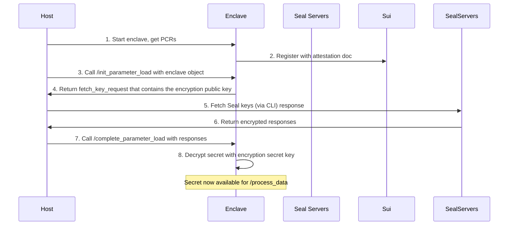

# Seal-Nautilus Pattern

The Seal-Nautilus pattern provides secure secret management for enclave applications, ensuring the Seal secret is only accessible within verified enclaves. Here we reuse the weather example. Instead of storing the `weather-api-key` with AWS Secret Manager, we store it with Seal, and shows that only the enclave with the expected PCRs have access to it. 

## Components

1. Nautilus Enclave (Port 3000) running inside AWS Nitro enclave: This is the only place that has access to the decrypted Seal secret. It also handles using the secret to process data. 

2. Host-Only Server (Port 3001) running on the host where the enclave is, it can only be used to initialize and complete the bootstrap steps to set the secret.

3. Seal CLI that can be ran anywhere. It has an encrypt and a fetch key function.

4. On-Chain Components: `seal_policy.move` defines the `seal_approve` policy. 

## Data Flow



## Two-Phase Bootstrap

The enclave is first registered and started running. The secret is then loaded via host only commands. 

```
Phase 1: Registration (No Secrets Needed)
├── 1. Start enclave with empty/placeholder secrets
├── 2. Generate attestation document  
├── 3. Register enclave on-chain → Get Enclave Object
└── 4. Enclave is now registered but not yet populated with the secret to serve request

Phase 2: Secret Loading (Using Registered Enclave)
├── 1. Host calls /init_parameter_load with the Enclave Object
├── 2. Enclave creates a signed Seal request using its ID
├── 3. Host fetches encrypted keys from Seal servers
├── 4. Host calls /complete_parameter_load to deliver encrypted secrets
└── 5. Enclave decrypts and loads secrets → Now fully functional
```

### Why Two-Phase Bootstrap?

The two-phase bootstrap is needed because enclaves operate without direct internet access and cannot fetch secrets from Seal key servers URL themselves. As a workaround, the host acts as an intermediary to retrieve encrypted secrets from Seal servers. This delegation is secure because the fetched responses are encrypted using the enclave's ephemeral public key, and only the enclave possesses the corresponding private key for decryption. Additionally, the enclave is booted with hardcoded public keys of the Seal servers it depends on, so it can verify the authenticity of the responses passed from host, so the host cannot tamper with or forge server responses.

## Security Guarantees

The secret is only accessible within the verified enclave because:

- **Ephemeral Key Generation**: The enclave generates an unique ElGamal key pair during initialization.
- **Encrypted Transport**: Seal servers encrypt the secret to this ephemeral public key. The host receives it but cannot decrypt it, only the enclave can. 
- **Private Key Isolation**: The ephemeral private key never leaves the enclave memory.
- **Attestation Binding**: The on-chain `seal_approve` function verifies signature against the enclave public key. The signature can only be produced by the enclave held wallet. 

## Seal Approval Function

```move
entry fun seal_approve<T: drop>(_id: vector<u8>, enclave: &Enclave<T>, ctx: &TxContext) {
    assert!(ctx.sender().to_bytes() == pk_to_address(enclave.pk()), ENoAccess);
}

fun pk_to_address(pk: &vector<u8>): vector<u8> {
    let mut arr = vector[0u8];
    arr.append(*pk);
    let hash = blake2b256(&arr);
    hash
}

```

This function ensures the transaction sender matches the enclave's registered public key. The signature of the ephemeral key is verified during dry run by Seal servers. This ensures only the enclave can produce such signature using its ephemeral key. 

The `id` can be anything that identifies the key. A Sui address is derived as the `blake2b_hash(flag || pk)`. Here we assume the enclave's ephemeral key scheme is Ed25519 so flag is `0x00`. 

## Using the seal-example weather service:

### Step 0: Build, Run and Register Enclave

Refer to the main guide for a more detailed instruction. 

```shell
# publish the enclave package
cd move/enclave
sui move build && sui client publish

ENCLAVE_PACKAGE_ID=0xe796d3cccaeaa5fd615bd1ac2cc02c37077471b201722f66bb131712a86f4ab6

# publish the app package
cd move/seal-example
sui move build && sui client publish

CAP_OBJECT_ID=0xad6399fccb6b407f220b915d93041cd4a3f0f676a46ba0346a6b89ff8bc64225
ENCLAVE_CONFIG_OBJECT_ID=0x3d1305fe6e2e1204effb139b601d61a1078e0ec43e654289e39dd17130a8faa8
APP_PACKAGE_ID=0x1310ea295e328efbb4bc269ae08f053c5c179136ef5ad29d382d3213ea09f3c9

# update seal_config.yaml with APP_PACKAGE_ID inside the enclave
# in the enclave: build, run and expose
make ENCLAVE_APP=seal-example && make run && sh expose_enclave.sh

# record the pcrs 
cat out/nitro.pcrs

PCR0=5ec7d4609580213731b338d68f32fbca0ac178c8061cd95575c42a160f76c878374bcf64f2fb985e37fe2c87e59014bb
PCR1=5ec7d4609580213731b338d68f32fbca0ac178c8061cd95575c42a160f76c878374bcf64f2fb985e37fe2c87e59014bb
PCR2=21b9efbc184807662e966d34f390821309eeac6802309798826296bf3e8bec7c10edb30948c90ba67310f7b964fc500a

# test data
PCR0=000000000000000000000000000000000000000000000000000000000000000000000000000000000000000000000000
PCR1=000000000000000000000000000000000000000000000000000000000000000000000000000000000000000000000000
PCR2=000000000000000000000000000000000000000000000000000000000000000000000000000000000000000000000000
# populate name and url
MODULE_NAME=weather
OTW_NAME=WEATHER
ENCLAVE_URL=http://<PUBLIC_IP>:3000

# update pcrs
sui client call --function update_pcrs --module enclave --package $ENCLAVE_PACKAGE_ID --type-args "$APP_PACKAGE_ID::$MODULE_NAME::$OTW_NAME" --args $ENCLAVE_CONFIG_OBJECT_ID $CAP_OBJECT_ID 0x$PCR0 0x$PCR1 0x$PCR2

# optional, update name
sui client call --function update_name --module enclave --package $ENCLAVE_PACKAGE_ID --type-args "$APP_PACKAGE_ID::$MODULE_NAME::$OTW_NAME" --args $ENCLAVE_CONFIG_OBJECT_ID $CAP_OBJECT_ID "some name here"

# register the enclave onchain 
sh register_enclave.sh $ENCLAVE_PACKAGE_ID $APP_PACKAGE_ID $ENCLAVE_CONFIG_OBJECT_ID $ENCLAVE_URL $MODULE_NAME $OTW_NAME

# read from output the created enclave obj id and finds its initial shared version. 
ENCLAVE_OBJECT_ID=0x53a55d582d2319898e583c9e384b4869e3d2237cddd383fd959bf9316197c0c3
ENCLAVE_OBJ_VERSION=583138765
```

Currently, the enclave is running but has no Seal secret and cannot process requests. 
```bash
curl -H 'Content-Type: application/json' -d '{"payload": { "location": "San Francisco"}}' -X POST http://<PUBLIC_IP>:3000/process_data

{"error":"API key not initialized. Please complete parameter load first."}%
```

### Step 1: Encrypt Secret (One-time Setup)

The Seal CLI command can be ran in the root of [Seal repo](https://github.com/MystenLabs/seal). This step can be done anywhere where the secret value is secure. The output is later used for step 4. 

This command looks up the public keys of the specified key servers ID using public fullnode on the given network. Then it uses the identity `id`, threshold `t`, the specified key servers `-k` and the policy package `-p` to encrypt the secret. 

```bash
cargo run --bin seal-cli encrypt --secret 045a27812dbe456392913223221306 \
    --id 0000 \
    -p $APP_PACKAGE_ID \
    -t 2 \
    -k 0x73d05d62c18d9374e3ea529e8e0ed6161da1a141a94d3f76ae3fe4e99356db75,0xf5d14a81a982144ae441cd7d64b09027f116a468bd36e7eca494f750591623c8 \
    -n testnet

# Output: <ENCRYPTED_OBJECT>
```

`--secret`: The secret value that you are encrypting, that later only the enclave has access to. Here we use the weather api key as an example.  
`--id`: An identifier that can be defined as anything, as long as consistent with the one used in the next step in the `/init` request. Here we use `0000` as an example. 
`-p`: The package ID is the package containing the Seal policy. 
`-k`: A list of key server object ids, here we use the two mysten open testnet servers. 
`-t`: Threshold used for encryption. 
`-n`: The network the key servers you are using.

### Step 2: Load the encrypted secret to enclave

This step is done in the host that the enclave runs in, that can communicate to the enclave via 3001. 

In this call, the enclave generates an ephemeral ElGamal keypair and temporily stores in memory. It then creates the certificate containing the constructed PTB calling `seal_approve` with enclave object ID. The enclave ephemeral key signs request with session key and returns encoded fetch request. 

```bash
curl -X POST http://localhost:3001/seal/init_parameter_load -H 'Content-Type: application/json' -d '{"enclave_object_id": "<ENCLAVE_OBJECT_ID>", "initial_shared_version": <ENCLAVE_OBJ_VERSION>, "id": "0000" }'

# Output: {"encoded_request": "<ENCODED_REQUEST>"}
```

### Step 3: Fetch Keys from Seal Servers

The Seal CLI command can be ran in the root of [Seal repo](https://github.com/MystenLabs/seal). This can be done any with Internet connection. 

This command parses the hex BCS encoded `FetchKeyRequest` and fetches keys from the specified key server objects for the given network. The key servers verifies the PTB and signature, then returns encrypted key shares (encrypted to enclave's ephemeral ElGamal key) if the seal policy is satifies. The response is an encoded list of Seal server responses. 

```bash
cargo run --bin seal-cli fetch-keys --request <ENCODED_REQUEST> \
    -k 0x73d05d62c18d9374e3ea529e8e0ed6161da1a141a94d3f76ae3fe4e99356db75,0xf5d14a81a982144ae441cd7d64b09027f116a468bd36e7eca494f750591623c8 \
    -t 2 \
    -n testnet

Encoded seal responses:
<ENCODED_SEAL_RESPONSES>
```

`-k`: A list of key server object ids, here we use the two mysten open testnet servers. 
`-t`: Threshold used for encryption. 
`-n`: The network the key servers you are using.

### Step 4: Complete Secret Loading

This step is done in the host that the enclave runs in, that can communicate to the enclave via 3001. 

```bash
curl -X POST http://localhost:3001/seal/complete_parameter_load \
  -H "Content-Type: application/json" \
  -d '{
    "encrypted_object": "<ENCRYPTED_OBJECT>",
    "seal_responses": "<SEAL_RESPONSES>"
  }'
null # ok
```

In this call, the enclave uses its ephemeral secret key to decrypt key shares and performs threshold decryption to recover the secret. Then the enclave finishes the bootstrap phase by storing the decrypted secret in memory. In our example, this is the weather api key.

### Step 5: Use the Service

```bash
curl -H 'Content-Type: application/json' -d '{"payload": { "location": "San Francisco"}}' -X POST http://<PUBLIC_IP>:3000/process_data

{"response":{"intent":0,"timestamp_ms":1755805500000,"data":{"location":"San Francisco","temperature":18}},"signature":"4587c11eafe8e78c766c745c9f89b3bb7fd1a914d6381921e8d7d9822ddc9556966932df1c037e23bedc21f369f6edc66c1b8af019778eb6b1ec1ee7f324e801"}
```

## Handle Multiple Secrets

Repeat step 1 with different `id` values for different secrets. During /init, pass in all ids in an array so the ptb is constructed over all ids. Then during /complete_parameter_load, multiple encrypted_objects can be passed. In this example, we show two encrypted secrets, one is the weather api key, and the other is a dummy string e.g. `hello`. The latter is returned in the response to show it works. Modify or remove with your own application if needed. 

```
cargo run --bin seal-cli encrypt --secret hello \
    --id 0001 \
    -p $APP_PACKAGE_ID \
    -t 2 \
    -k 0x73d05d62c18d9374e3ea529e8e0ed6161da1a141a94d3f76ae3fe4e99356db75,0xf5d14a81a982144ae441cd7d64b09027f116a468bd36e7eca494f750591623c8 \
    -n testnet
```

## Multiple Enclaves

If you want to define multiple enclaves to have access to the same Seal encrypted secret, define the seal_approve on EnclaveConfig object. // review this